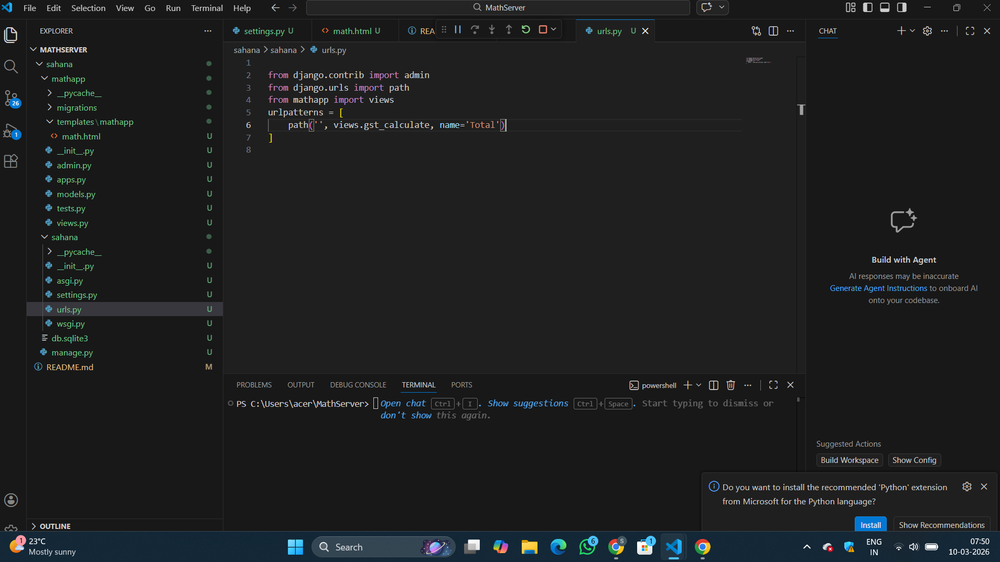
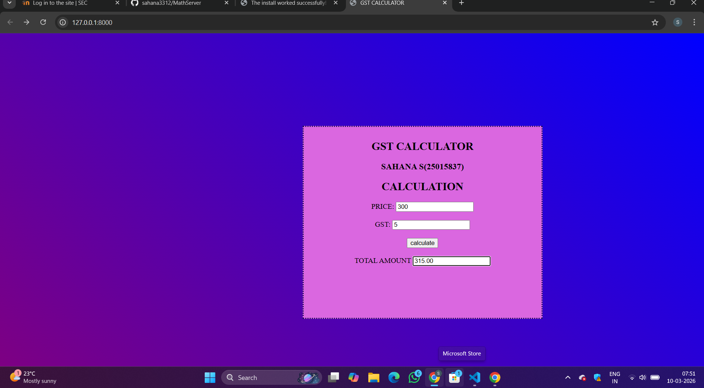

# Ex.04 Design a Website for Server Side Processing
## Date:10-03-2026

## AIM:
To create a web page to calculate total bill amount with GST from price and GST percentage using server-side scripts.

## FORMULA:
Bill = P + (P * GST / 100)
  P --> Price (in Rupees)
  GST --> GST (in Percentage)
  Bill --> Total Bill Amount (in Rupees)

## DESIGN STEPS:

### Step 1:
Clone the repository from GitHub.

### Step 2:
Create Django Admin project.

### Step 3:
Create a New App under the Django Admin project.

### Step 4:
Create a HTML file to implement form based input and output.

### Step 5:
Create python programs for views and urls to perform server side processing.

### Step 6:
Receive input values from the form using request.POST.get().

### Step 7:
Calculate the total bill amount (including GST).

### Step 8:
Display the calculated result in the server console.

### Step 9:
Render the result to the HTML template.

### Step 10:
Publish the website in Localhost.

## PROGRAM:

<html>
    <head>
        <title>GST CALCULATOR</title>
        
    </head>
    <body>
        

            <h2 align="center">GST CALCULATOR</h2>
            <h3 align="center">SAHANA S(25015837) </h3>
            <h2 align="center">CALCULATION</h2>
            <form method="POST" align="center">
        
                <label>PRICE:</label>
                <input type="text" name="price" value="{{ price }}">
                 
                 
                <label>GST:</label>
                <input type="text" name="gst" value="{{ gst }}">
                 
                 
                <input type="submit" value="calculate">
                 
                 
                <label>TOTAL AMOUNT</label>
                <input type="text" name="total_amount" value="{{ total_amount }}">
            </form>
        

    </body>
</html>

views.py 

from django.shortcuts import render
def gst_calculate(request):
    price = int(request.POST.get('price', '0'))
    gst = int(request.POST.get('gst', '1'))
    total_amount=price+(price*gst/100) if request.method == 'POST' else 0
    print("Price=",price)
    print("GST=",gst)
    print("Total Amount=",total_amount)
    return render(request, 'mathapp/math.html', {'Price': price, 'GST': gst, 'Total Amount': total_amount})

urls.py

from django.contrib import admin 
from django.urls import path  
from mathapp import views
urlpatterns = [
    path('', views.gst_calculate, name='Total')
]

## OUTPUT - SERVER SIDE:

## OUTPUT - WEBPAGE:

## RESULT:
The a web page to calculate total bill amount with GST from price and GST percentage using server-side scripts is created successfully.
